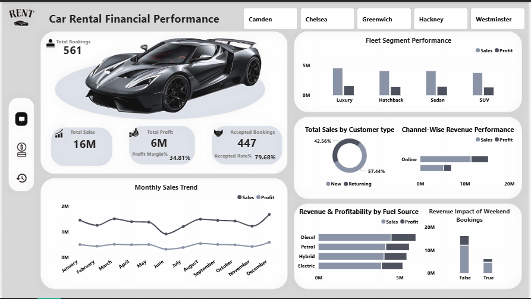

# 🚗 London Fleet: Revenue & Profitability Analysis

## 🛠️ Tech Stack

## 📌 Project Overview
This project provides a comprehensive financial and operational analysis of a car rental service operating across major London hubs. The analysis focuses on revenue realization, fleet profitability, and customer behavior patterns across multiple vehicle segments and fuel types.

> **Note:** This is a **technical simulation**. The original dataset was cleaned and transformed from its original regional context into a London-based operational model (mapping cities like Bangalore and Mumbai to Westminster and Chelsea) to demonstrate data remapping and localized market analysis.

---

## 🛠️ Tools & Technologies
* **Excel:** Primary tool for heavy lifting in data cleaning, city remapping, and initial data structuring.
* **Power BI:** Advanced data modeling, DAX measure development, and interactive visualization.
* **Canva:** Utilized for creating a custom professional dashboard background and layout.

---

## 🧼 Data Cleaning & Transformation (Excel)
The data underwent a rigorous cleaning process in Excel to ensure the final dashboard was accurate and professional:
* **City Remapping:** Used `SWITCH` and nested `IF` logic to transform geographic data into a London-based operational model (e.g., *Bangalore → Westminster*, *Mumbai → Chelsea*).
* **Text Standardization:** Applied the `TRIM` function across all categorical columns to remove hidden white spaces that cause errors in Power BI relationships.
* **Data Validation:** Standardized date formats and ensured financial columns (`Sales_Amount`, `Cost_Amount`) were formatted as currency for accurate calculation.
* **Logic Filters:** Separated "Accepted" bookings from "Rejected" ones to focus the financial analysis on **Realized Revenue**.

---

## 📊 Key Performance Indicators (KPIs)
Custom DAX measures were created to drive deeper business insights:
* **Total Sales & Profit:** Aggregated revenue and net gain from all accepted bookings.
* **Fleet Segment Performance:** Analysis of revenue contribution by Car Type (Luxury, SUV, Sedan, Hatchback).
* **Energy Mix Efficiency:** Tracking the profitability of Electric and Hybrid vehicles versus traditional Petrol/Diesel engines.
* **Acquisition vs. Retention:** Comparing sales volume between New and Returning customers to measure loyalty.

---

## 📈 Insights & Findings
* **The "London" Hub Effect:** Central hubs like Westminster and Chelsea showed higher demand for Luxury segments, while Camden saw higher turnover for Hatchbacks.
* **Weekend Surge:** Significant revenue spikes were identified in Weekend Bookings, suggesting opportunities for dynamic peak-period pricing.
* **Green Transition:** Hybrid and Electric vehicles are showing competitive profit margins, indicating a strong business case for fleet electrification.
* **Channel Performance:** Online bookings significantly outperform offline channels in volume, though offline bookings often carry higher daily rates.

## 🚀 Recommendations

 The following strategic actions are recommended:

* **Dynamic Pricing:** Implement a 10-15% price multiplier for weekend bookings in high-demand hubs (Westminster/Chelsea) to capture additional revenue during peak demand.
* **Fleet Optimization:** Reallocate procurement budget from economy Hatchbacks toward Premium Sedans and SUVs, which demonstrate a higher Profit Margin per rental day.
* **Sustainability Strategy:** Accelerate EV/Hybrid fleet integration to align with London’s ULEZ regulations and appeal to the growing eco-conscious urban demographic.
* **Loyalty Incentives:** Launch a tiered loyalty program targeting "Returning" customers to increase Lifetime Value (LTV) and reduce long-term Customer Acquisition Costs (CAC).

---
---

## 📂 Project Structure
* `Dataset/`: Contains the `RentCarSales.csv` cleaned via Excel.
* `Dashboard/`: The `.pbix` file and the background design assets.
* `Images/`: Dashboard screenshots and UI previews.

---
